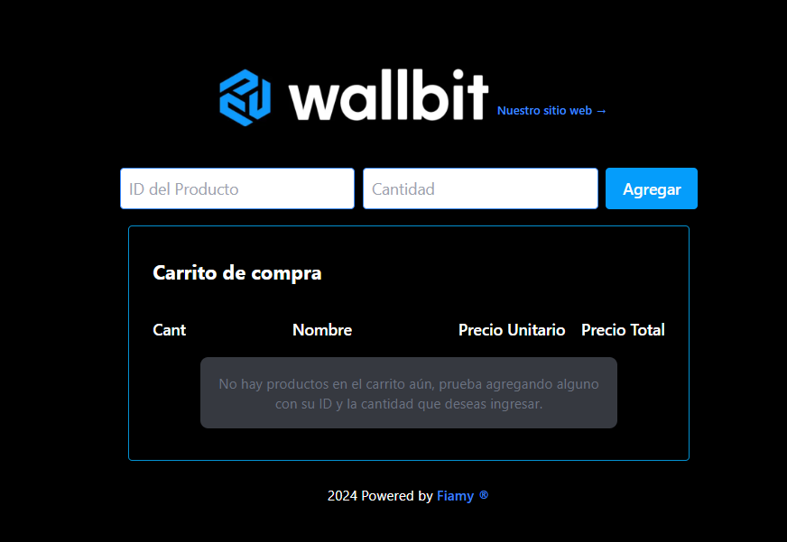
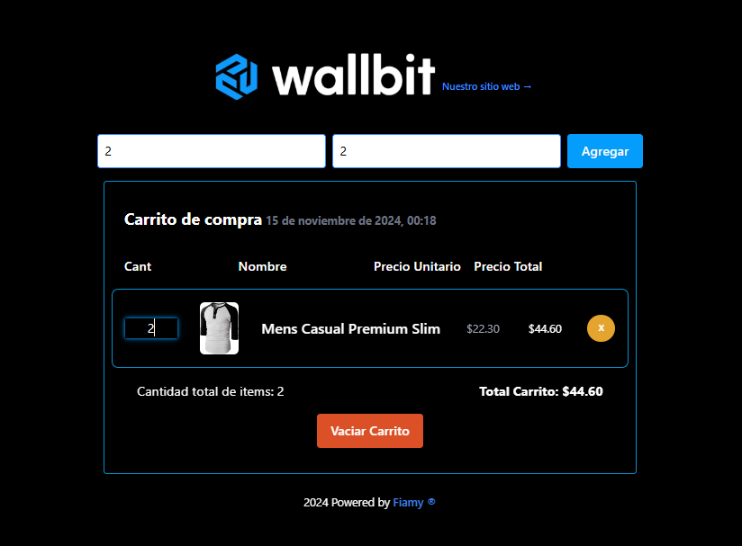

# Wallbit Junior Frontend Challenge - README

  
  

Este proyecto es una solución al desafío de frontend propuesto por Wallbit y Gonzalo Pozzo, en el que se debía crear un carrito de compras utilizando preferentemente React. A continuación, se detallan las características implementadas y los pasos para correr el proyecto.

## Descripción del Proyecto

El objetivo de este ejercicio fue desarrollar una aplicación que permita a los usuarios agregar productos a un carrito de compras utilizando únicamente el ID del producto y la cantidad deseada. La aplicación utiliza la API de [Fake Store API](https://fakestoreapi.com/) para obtener la información de los productos.

## Características Implementadas

- **Agregar productos al carrito**: Los usuarios pueden ingresar el ID del producto y la cantidad deseada para agregar productos al carrito.
- **Manejo de errores**: Se manejan los errores que devuelve la API, mostrando mensajes adecuados al usuario.
- **Lista de productos agregados**: Se muestra una tabla con los productos agregados al carrito, incluyendo:
  - Título del producto
  - Precio del producto
  - Imagen del producto
  - Cantidad agregada por el usuario

### Extras

- **Persistencia del carrito**: El carrito se mantiene al recargar la página.
- **Total de productos**: Se muestra el total de productos agregados en el carrito.
- **Costo total del carrito**: Se calcula y muestra el costo total de todos los productos en el carrito.
- **Fecha de creación del carrito**: Se muestra la fecha
  - Se mantiene al recargar la página, no desaparece
  - Al vaciar el carrito se reinicia la fecha
  - Al eliminar todos los items se reinicia
  - No cambia el valor al refrescar

### Extras 2

- **Notificaciones visuales**: Se implementaron alertas que indican cuando un producto ha sido agregado con éxito
- **Estilo de UI**: Se utilizó Tailwind CSS para proporcionar un diseño acorde a Wallbit
- **Manejo de Cantidad**: Se incorporó un input que permite a los usuarios especificar la cantidad deseada para cada producto desde cada item al presionar el numero de cantidad. Si el usuario intenta establecer la cantidad en cero y luego sale del campo, el valor anterior se restaurará automáticamente, garantizando que no se guarde un valor invalido ni negativo.

## Cómo Correr el Proyecto

Este proyecto fue desarrollado utilizando Vite con React, TypeScript, PNPM y Tailwind CSS. A continuación se detallan los pasos para instalar y correr la aplicación:

## Requisitos Previos

✅ Asegúrate de tener instalado Node.js y PNPM en tu sistema. Puedes verificar si están instalados ejecutando los siguientes comandos:

| Comando   | Descripción                   |
| --------- | ----------------------------- |
| `node -v` | Muestra la versión de Node.js |
| `pnpm -v` | Muestra la versión de PNPM    |

### Clona el repositorio y configura el proyecto

A continuación, sigue estos pasos para clonar el repositorio e instalar las dependencias:

| Comando                                                            | Descripción                          |
| ------------------------------------------------------------------ | ------------------------------------ |
| `git clone https://github.com/FiammaMuscari/wallbit-challenge.git` | Clona el repositorio                 |
| `cd wallbit-challenge`                                             | Cambia al directorio del repositorio |
| `pnpm install`                                                     | Instala las dependencias             |
| `pnpm run dev`                                                     | Inicia el servidor de desarrollo     |

Ahora puedes abrir el navegador en [http://localhost:5173/](http://localhost:5173/) y ver el proyecto sin problema.

  

    Redes
  

  

    
    
  

